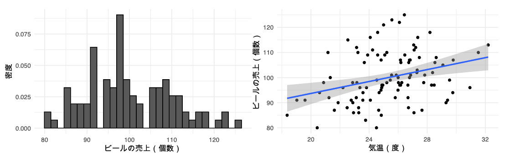
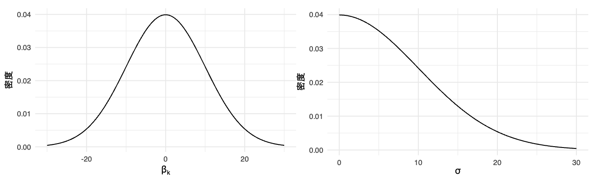

## はじめに

**概要**

この記事は，`{cmdstanr}`の使い方を解説するものです．`{cmdstanr}`とは，Rのパッケージであり，Stan[^stan]を実装する手段であるCmdStanをRで使うために提供されています．

[^stan]: Stanとは，プログラミング言語のひとつで，ベイズ推定を高速で処理するために使われます．

**紹介**

統計学を齧っている経済学部4回生（ベイジアンの卵）です．
学部生なので間違っている箇所が多数あるかもしれません．ご指摘ください．

**経緯**

後輩たちの学習環境を整えるために，研究室の同期で[`{cmdstanr}`のサポートページ](https://yanai-lab.github.io/cmdstanr/)を作成することになりました[^why].しかし，現在（2024年6月15日）は，章立てや書く内容などがしっかりと決まっているわけではなく，ぼんやりと完成系のイメージがあるだけです．そこで，そのイメージを具体化し，目標を明確化するために本記事を書くに至りました．

[^why]: ちなみに，サポートページを作ることになったのは，以前私が[Qiita](https://qiita.com/)に投稿した[『ベイズ統計でKaggleを解いてみる』](https://qiita.com/Honoka-Nakano/items/b99ea3c7df57a7652bb8/)という記事が研究室内で取り上げられたからです．

**対象者**

Rの基本操作を理解している方，統計学及びベイズ統計学の基礎を習得済み[^warn]だが，実際にどう分析を進めたら良いのかわからない方を対象とします．サポートページでは，ベイズ統計学の基礎から解説します（予定）が，本記事では省略します[^basic]．

[^warn]: 統計用語を断りなく使います．
[^basic]: ひとりで解説するのは自信がないためです．サポートページは，指導教員監修のもと作成します．

**実行環境**

実行環境[^env]は以下を参照してください．

[^env]: `{cmdstanr}`以外に，各種パッケージ（`{tidyverse}`, `{posterior}`）を使います．

- MacOS Sonoma 14.5
- R version 4.4.0 (2024-04-24)
- RStudio 2024.04.2+764 (2024.04.2+764)
- `{cmdstanr}` 0.7.1
- `{tidyverse}` 2.0.0
- `{posterior}` 1.5.0

```r
> sessionInfo()
R version 4.4.0 (2024-04-24)
Running under: macOS Sonoma 14.5
 [1] posterior_1.5.0 cmdstanr_0.7.1 lubridate_1.9.3
 [4] forcats_1.0.0   stringr_1.5.1  dplyr_1.1.4
 [7] purrr_1.0.2     readr_2.1.5    tidyr_1.3.1
[10] tibble_3.2.1    ggplot2_3.5.1  tidyverse_2.0.0
```

## {cmdstanr}の解説

### インストール

Mac OSで`{cmdstanr}`をインストールするには，以下のコードを実行します．

```r:R console
> install.packages('cmdstanr',
+                  repos = c('https://mc-stan.org/r-packages/',
+                            getOpition('repos')))
```

インストールが完了したら，パッケージを読み込みます．

```r
> library(cmdstanr)
```

CmdStanをインストールするには，`C++ toolchain`が必要なので，それが使える状態かどうかを確認します．

```r:R console
> check_cmdstan_toolchain()
```

`The C++ toolchain required for CmdStan is setup properly!`というメッセージが出てきたら使える状態です．

`C++ toolchain`を使えることが確認できたら，以下のコードでCmdStanをインストールします．使用するCPUコアの数は自分の環境に合わせて変えてください[^core]．

[^core]: コア数は，「設定」>「一般」>「情報」>「システムレポート」から確認できます．ターミナルで`$ sysctl -n hw.logicalcpu_max`と入力することでも確認できます．

```r: R console
> install_cmdstan(cores = 8)
```

インストールされているかを以下のコードで確認します．

```r:R console
> cmdstan_version()
[1] "2.34.1"
```

バージョン2.34.1のCmdStanがインストールされていることが確認できました．

**他パッケージのインストール**

分析で用いる他のパッケージをインストールします．

```r:R console
> install.packages(c('tidyverse',
+                    'posterior',
+                    'parallel'))
```

### 使ってみよう

実際にベイズ推定を行いながら，`{cmdstanr}`を使ってみましょう．

分析に使うデータとソースコードは私の[GitHub](https://github.com/Honoka-Nakano/cmdstanr-qiita)にて公開しています（データは解説のために用意したフェイクです）．必要があればダウンロードしてください．

事前の準備として，以下のコードを実行しておいてください．

```r:cmdstan.R
> pacman::p_load(tidyverse,
+                cmdstanr,
+                posterior)
> options(mc.cores = parallel::detectCores())
```

#### 問題設定

今回は，「ビールの売上は，気温によってどのくらい変動するのか」という問題[^problem]をベイズ統計を用いて分析しようと思います．ビールの売上は金額ではなく個数とします．

[^problem]: [『RとStanではじめる　ベイズ統計モデリングによるデータ分析入門』](https://www.kspub.co.jp/book/detail/5165362.html)（馬場真哉, 2019）で取り上げられている問題を一部改変したものです．野球の試合会場におけるビールの売り上げを想像するとわかりやすいかもしれません．

分析の過程は以下の通りです[^process]．

[^process]: 2.Rでデータリストの作成 と 3.Stanファイルの記述 は前後しても問題ありません．人によっては逆の順番の方が理解しやすいかもしれません．

1. データ生成過程の確認・モデルの作成
2. Rでデータリストの作成
3. Stanファイルの記述
4. MCMCの実行
5. 結果の確認

データには，ビールの売上（結果変数; $Y$）と気温（説明変数; $X$），そして推定精度向上のために来客数（説明変数; $Z$）があります[^var]．サンプルサイズは$N = 100$です．

[^var]: 因果推論をする際，交絡変数を統制する（回帰式に含める）ことは必須です．それに加えて，結果変数のみに影響を与える変数も統制するべきです．推定精度の向上が見込まれるからです（詳細な説明は省く）．

以下に，観測データを可視化したグラフを載せておきます．



#### 1. データ生成過程の確認・モデルの作成

ベイズ推定に限らず実証分析を行う際，必ずデータ生成過程を確認します．データ生成過程とは，その名の通り結果変数のデータがどのように生成されたのか，その過程のことです．それを元に分析で用いるモデルを作成します（以下，$n = 1, 2, ..., N$）．

今回の売上データ$y_n$は，平均$\mu_n$，標準偏差$\sigma$の正規分布から生成されたと仮定します．

$$
\begin{align}
    & y_n \sim \mbox{Normal} (\mu_n, \sigma) & (\text{尤度関数})
\end{align}
$$

これが尤度関数です．続いて，結果変数$y_n$が従う正規分布の平均$\mu_n$をリンク関数を用いて表現します．$x_n$は気温，$z_n$は来客数です．

$$
\begin{align}
    & \mu_n = \beta_1 + \beta_2 x_n + \beta_3 z_n & (\text{リンク関数})
\end{align}
$$

最後に，パラメタの事前分布を設定します．今回は，どのパラメタにも「こうだ」という信念がないことを表現するために，平均0，標準偏差10の正規分布を事前分布として採用します．ただし，$\sigma$は正の値しか取り得ないため，$\mbox{Normal}^+(0, 10)$としています．

```math
\begin{align}
    \beta_k & \sim \mbox{Normal} (0, 10)
        \quad (k = 1, 2, 3) & (\text{事前分布}) \\
    \sigma & \sim \mbox{Normal}^+ (0, 10)
\end{align}
```



以上が，今回のベイズ推定で用いるモデルとなります．

:::note info
モデルの書き方には複数あります．例えば，

```math
\begin{align}
    y_n & \sim \mbox{Normal} (\beta_1 + \beta_2 x_n + \beta_3 z_n, \sigma) \\
    \beta_k & \sim \mbox{Normal} (0, 10) \quad (k = 1, 2, 3) \\
    \sigma & \sim \mbox{Normal}^+ (0, 10)
\end{align}
```

と，リンク関数を使わずに書く方法や，

```math
\begin{align}
    y_n & = \beta_1 + \beta_2 x_n + \beta_3 z_n + \varepsilon_n \\
    \varepsilon_n & \sim \mbox{Normal} (0, \sigma) \\
    \beta_k & \sim \mbox{Normal} (0, 10) \quad (k = 1, 2, 3) \\
    \sigma & \sim \mbox{Normal}^+ (0, 10)
\end{align}
```

のように，誤差項を用いて書いても良いです．
:::

#### 2. Rでデータリストの作成

Stanファイルを記述する際，分析に用いるデータをStanに引き渡す必要があります．CmdStanでは，Rでデータをリスト型にまとめることで引き渡し可能となります．

まず，観測データを読み込みます．

```r:cmdstan.R
> myd <- read_csv('data.csv')
```

念の為，観測データの中身を確認しておきましょう．

```r:cmdstan.R
> glimpse(myd)
Rows: 100
Columns: 3
$ sales       <dbl> 92, 101, 88, 107, 95, 115, 109, 112, 106, 116, 99...
$ temperature <dbl> 23.12, 25.55, 22.49, 29.79, 25.99, 22.54, 26.46, ...
$ people      <dbl> 269, 302, 254, 308, 267, 388, 336, 346, 319, 384,...
```

`sales`, `temperature`, `people`に加えて，サンプルサイズ（今回は$N = 100$）もStanに引き渡す必要があります．これらをリストにまとめましょう．

```r:cmdstan.R
> myd_list <- list(
+    N = nrow(myd),       # サンプルサイズ(N = 100)
+    Y = myd$sales,       # ビールの売数(結果変数Y)
+    X = myd$temperature, # 気温(説明変数X)
+    Z = myd$people       # 来客数(説明変数Z)
+ )
```

#### 3. Stanファイルの記述

RStudioの`File` > `New File`から`Stan File`を選択し，作成します．

Stanには記述のルールがいくつかあります．コードの末尾に`;`を書くことと，ファイルの最後の行は空白とすることです[^10]．加えてStanファイルでは，必ず`data{}`ブロック，`parameters{}`ブロック，`model{}`ブロックの3つのブロックを書きます[^11]．各ブロックで書く内容は以下です．

[^10]: これは他の言語でも同じですね．
[^11]: 必須なのは3ブロックですが，今回は`{transformed parameters}`ブロックも書きます．その方が，尤度関数とリンク関数を分けて書くことができてわかりやすいためです．

**`data{}`ブロック**

このブロックでは，分析に用いるデータを定義します．先ほどRでリスト化したデータのことです．これは，Rから渡されるデータなので，リスト化した際に指定したオブジェクト名を使わなければなりません．つまり，サンプルサイズ$N$は`N`，売上データは`Y`のように書く必要があります．

```stan:cmdstan.stan
data {
    int<lower=0> N;  // サンプルサイズ
    array[N] int Y;  // ビールの売上
    array[N] real X; // 気温
    array[N] int Z;  // 来客数
}
```

Stanではデータ型を指定します．サンプルサイズは整数型なので`int N;`と書きます．ここで`<lower=0>`とは，`N`の取り得る最小値は0であるという意味です．サンプルサイズが負の値になることはないので付け足しておきます．こうすることで，なんらかのミスで負の値が引き渡されてもエラーを出力してくれます．

売上データ`Y`はビールの個数を表す$N$個の整数型データです．そのため，`array[N] int Y;`とします．`array[N]`は要素が$N$個の配列という意味です．その後に`int`と指定します．

気温データ`X`は，$N$個の実数型データです．そのため，`array[N] real X;`とします．実数型なので`real`と指定します．

来客数データ`Z`は，$N$個の整数型データです．売上データと同じく，`array[N] int Z;`とします．

**`parameters{}`ブロック**

このブロックでは，推定したいパラメタを記述します．今回推定したいのは，モデル内にある$\beta_1, \beta_2, \beta_3, \sigma$の4つです．これら全てが実数を取り得るので，実数型として記述します．ただし，標準偏差$\sigma$は負の値となることはないので`<lower=0>`を付け足します．

```stan:cmdstan.stan
parameters {
    real beta1;          // 切片
    real beta2;          // 説明変数Xの係数
    real beta3;          // 説明変数Zの係数
    real<lower=0> sigma; // 結果変数が従う正規分布の標準偏差
}
```

**`{transformed parameters}`ブロック**

このブロックでは，`transformed parameters`という名の通り，`{parameters}ブロック`で定義したパラメタを変換するために記述します．

モデル内では，リンク関数を用いて観測データと$\beta_k(k = 1, 2, 3)$から$\mu$を定義しています．これをStanでも記述します．

```stan:cmdstan.stan
transformed parameters {
    array[N] real mu;
    for (n in 1:N) {
        mu[n] = beta1 + beta2 * X[n] + beta3 * Z[n];
    }
}
```

まず，$N$個の実数である`mu`を定義します（`array[N] real mu;`）．続いて`for`文内で，各観測データ（`X[n]`, `Z[n]`）とパラメタ（`beta*`）を用いて，`mu`に値を代入します（`mu[n] = beta1 + beta2 * X[n] + beta3 * Z[n];`）．この`mu`を結果変数が従う正規分布の平均とします．

**`model{}`ブロック**

このブロックでは，先ほど仮定した分析モデルを記述します．

```stan:cmdstan.stan
model {
    Y ~ normal(mu, sigma);
    beta1 ~ normal(0, 10);
    beta2 ~ normal(0, 10);
    beta3 ~ normal(0, 10);
    sigma ~ normal(0, 10);
}
```

結果変数$Y$は，平均が先ほど変換した`mu`，標準偏差が`sigma`の正規分布に従い（`Y ~ normal(mu, sigma);`），パラメタは平均0，標準偏差10の正規分布（事前分布）に従う（`beta* ~ normal(0, 10);`, `sigma ~ normal(0, 10);`）という仮定を記述しています．

Stanファイルの記述は以上です．記述がより楽になる技術は様々ありますが，解説は省略します．

:::note warn
最後に空白の行を付け足すことを忘れずに！
:::

#### 4. MCMCの実行

いよいよMCMC（マルコフ連鎖モンテカルロ法; Markov Chain Monte Carlo）の実行です．

そのために，まずは先ほど作成したStanファイルをコンパイルします．

```r:cmdstan.R
> stan <- cmdstan_model('cmdstan.stan')
```

これを使って推定を実行します．パラメタの事後分布をMCMCでサンプリングするため，`$sample`を以下のように使います．

```r:cmdstan.R
> fit <- stan$sample(
+    data = myd_list,     # 分析に用いるデータのリスト
+    seed = 123,          # 乱数の種
+    chains = 4,          # チェイン数(規定値は4)
+    refresh = 1000,      # コンソールに表示される結果の間隔
+    iter_warmup = 1000,  # バーンイン期間
+    iter_sampling = 3000 # サンプリング
+ )
Chain 1 finished in 2.3 seconds.
Chain 2 finished in 2.0 seconds.
Chain 3 finished in 1.7 seconds.
Chain 4 finished in 2.3 seconds.
All 4 chains finished successfully.
Mean chain execution time: 2.1 seconds.
Total execution time: 2.4 seconds.
```

#### 5. 結果の確認

結果を確認してみましょう．`$summary()`を使います．

```r:cmdstan.R
> fit$summary()
# A tibble: 105 × 10
   variable    mean  median       sd     mad      q5     q95  rhat
   <chr>      <dbl>   <dbl>    <dbl>   <dbl>   <dbl>   <dbl> <dbl>
 1 lp__      76.3    76.6   1.45     1.25e+0  73.5    78.0    1.00
 2 beta1     10.2    10.2   0.321    3.17e-1   9.72   10.8    1.00
 3 beta2      1.19    1.19  0.0106   1.08e-2   1.17    1.21   1.00
 4 beta3      0.200   0.200 0.000592 5.81e-4   0.199   0.201  1.00
 5 sigma      0.280   0.279 0.0205   2.01e-2   0.248   0.316  1.00
 6 mu[1]     91.6    91.6   0.0402   3.99e-2  91.5    91.6    1.00
 7 mu[2]    101.    101.    0.0284   2.82e-2 101.    101.     1.00
 8 mu[3]     87.8    87.8   0.0484   4.79e-2  87.7    87.9    1.00
 9 mu[4]    107.    107.    0.0554   5.49e-2 107.    107.     1.00
10 mu[5]     94.6    94.6   0.0342   3.40e-2  94.5    94.6    1.00
# ℹ 95 more rows
# ℹ 2 more variables: ess_bulk <dbl>, ess_tail <dbl>
# ℹ Use `print(n = ...)` to see more rows
```

各パラメタの推定値が表示されています[^12]．ここで確認すべき点は，各パラメタの推定値が「収束」しているか否かです．もし結果が収束していないと，気温がビールの売上に与える影響$\beta_2$が，2かもしれないし-3かもしれない（あるいはこれら以外の数値かもしれない）ということになります．これでは解釈のしようがありません．

[^12]: `lp__`については解説を省略します．

**収束の確認**

収束しているかの確認には2つの手段があります．それが$\hat{R}$の値とトレースプロットの確認です．

まずは$\hat{R}$（上記の結果にある`rhat`）を確認します．ここで，`rhat`はすべてのパラメタで1.1以下でないと「収束している」とは言えません．ひとつひとつ確認することもできますが，以下のコードで一気に確認できます．

```r:cmdstan.R
> all(fit$summary()[, 'rhat'] < 1.1)
[1] TRUE
```

`TRUE`が返ってきたら，すべてのパラメタで`rhat`が1.1以下である（つまり収束確認の片方はクリア）ということです．

次にトレースプロットを確認します．今回のMCMCでは，1つのチェインで各パラメタの値を3,000（バーンイン期間を含めると4,000）個ずつ生成しています[^13]．その（推定）値の変遷を可視化したのがトレースプロットです．

[^13]: つまり，3,000回推定しているということです．

プロットのために，まずは結果をデータフレームとして得ます（`{posterior}`というパッケージを使います）．

```r:cmdstan.R
> post <- fit$draws() |>
+    as_draws_df() |>
+    mutate(chains = as.factor(.chain))
```

可視化には`{ggplot2}`を使います．

```r:cmdstan.R
> post |>
+    ggplot() +
+    geom_line(aes(x = .iteration,    # 繰り返し数
+                  y = beta2,         # トレースプロットを確認したいパラメタ
+                  color = chains)) + # チェインによって色を変える
+    labs(x = 'iteration', y = expression(beta[2])) +
+    theme_minimal() +
+    theme(legend.position = 'none')  # 凡例を消す（必須ではない）
```


横軸は`iteration`，つまり3,000回のうち何回目の乱数生成かを表し，縦軸が推定値を表しています．例として$\beta_2$（右上）を見ると，3,000回を通してほぼ全ての値が約1.19周辺にあります．つまり，そのあたりで収束しているということです．

各チェインによって線の色を変えているのは，結果が頑健であることを確認するためです．計4色の線がすべて同じくらいの位置で重なっていることから，どのチェインにおいても結果が収束していて，かつ推定値がほぼ一致していることがわかります．これらのことから，$\beta_2$の推定値は約1.19に収束していると言ってもいいでしょう[^14]．

[^14]: 他の変数についても，結果の収束が確認できます．

**結果の可視化**

私たちが最も知りたい$\beta_2$は，平均すると1.19であると推定されました．つまり，気温が1度上昇すると，ビールの売上は約1.19ポイント上昇するということです．

ベイズ推定では，推定値を分布で得ます．この結果を可視化してみましょう．

```r:cmdstan.R
> post |>
+    ggplot() +
+    geom_histogram(aes(x = beta2,
+                       y = after_stat(density)),
+                   color = 'black') +
+    labs(x = expression(beta[2]), y = '密度') +
+    theme_minimal()
```


このように，事前分布として設定した正規分布のパラメタが更新され，事後分布を結果として得ることができました．先ほど確認した通り，平均すると$\beta_2 = 1.19$と推定されていることがわかります[^15]．

[^15]: ちなみに今回使うデータを生成する際，$\beta_2 = 1.2$と設定していたため，かなり精度の高い推定となっています．

また，パラメタが特定の値以上（または以下）となる確率を求めることができます[^16]．例えば，推定値が1.17以上となる確率を求めることができます[^17]．

[^16]: 頻度主義統計学では，帰無仮説を棄却するか否かの2択でしか議論ができません．しかし，ベイズ統計であれば，パラメタが持つ影響の真偽を確率を用いて表現できます．これもベイズ統計の利点です．
[^17]: これには特に意味がありません．意味がある例としては，事後分布が0を跨いでいる際にパラメタが0より大きな値をとる確率`mean(post$beta2 > 0)`を求めるなどでしょうか．

```r:cmdstan.R
> mean(post$beta2 > 1.17)
[1] 0.9654167
```

約96.5%の確率で，気温がビールの売上に与える影響は1.17より大きくなることがわかりました[^18]．

[^18]: 繰り返しますが，これには特に意味がありません．

## まとめ

`{cmdstanr}`はRのパッケージであり，Stanを実装する手段であるCmdStanをRで使えるようにするための関数です．

分析の流れは以下の通りです．

1. データ生成過程の確認・モデルの作成
2. Rでデータリストの作成
3. Stanファイルの記述
4. MCMCの実行
5. 結果の確認

注意すべき点は，どんな分析においてもデータ生成過程を必ず確認すること，Stanに引き渡すデータは必ずしも観測データのみではない（サンプルサイズ$N$なども必要）ということ，Stanの記述にはいくつかルールがあること，結果が収束しているか確認することなどです．

## 最後に

本記事では，Rのパッケージである`{cmdstanr}`の使い方を解説しました．

より詳しい解説は，[公式ドキュメント](https://github.com/stan-dev/cmdstanr)または[`{cmdstanr}`サポートページ](https://yanai-lab.github.io/cmdstanr)（作成中）を参照してください．

## 付録

私が作成した`postdens_onesideplot()`[^19]という関数を用いても，事後分布を可視化することができます．詳細は[GitHub](https://github.com/Honoka-Nakano/Function)で．

[^19]: 指定した値よりも大きい（または小さい）部分を可視化し，その値を取る確率を出力する関数です．

```r:cmdstan.R
> postdens_onesideplot(post$beta2,                 # 可視化したいパラメタ
+                      cutpoint = 1.17,            # カットポイント
+                      xlab = expression(beta[2]), # x軸のラベル
+                      ylab = '密度') +            # y軸のラベル
+    theme_minimal()
prob: 0.9655
```


